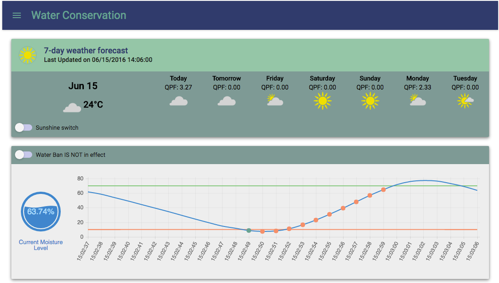

# streamsx.waterConservation.starterKit   [](https://bluemix.net/deploy?repository=https://github.com/IBMStreams/streamsx.waterConservation.starterKit.git)

## Overview



Water scarcity is one of the most pressing problems in the world right now.  According to the World Wildlife Fund (WWF), 70% of our planet is covered by water. However, only 3% of it is fresh water, and only one-third of that is available for consumption. Many water systems are stressed due to the growing human population and over-consumption. Agriculture consumes more water than any other source. Much of the water used in agriculture is wasted due to inefficient irrigation systems. To alleviate this problem, many governments impose restrictions on water usage, especially in drought-stricken states like California. However, these bans are difficult to enforce. For example, some people can afford to violate the restrictions and simply pay the fines.

To improve irrigation efficiency and properly enforce water usage restrictions, this starter kit is a prototype for a smarter, connected sprinkler system.

### Water Conservation Application Architecture

The starter kit demonstrates the reference architecture of using Apache Edgent and how it can work in conjunction with a centralized analytics system.  


This system consists of two main analytics components:

* Analytics on edge devices: We used a Raspberry Pi to simulate a smart sprinkler device. On the device, local soil conditions like moisture level are continuously collected and analyzed using Apache Edgent. When the device detects that the soil is too dry and requires watering, it sends a request to the centralized analytics system for permission to turn on the sprinkler. The smart sprinkler system will not turn on the sprinkler unless it is approved by the centralized analytics system.
* Centralized streaming analytics system: In the centralized analytics system, we used the Streaming Analytics service to analyze the incoming water requests in real time. To approve a water request, the application checks the weather forecast for the next two days using the Weather Company Data API. If there is not enough precipitation in the forecast, it checks to see if a water ban is currently in effect. The Streams application will approve the water request only if there is not enough precipitation in the forecast and if there is no water ban in effect.

For rapid application development, we leveraged other IBM Bluemix services. These services handle the infrastructure and connectivity, allowing us to focus on developing the analytics and business logic of the application. For the device to communicate with the centralized analytics system, we used the Watson Internet of Things Platform. This service handles application connectivity for us, allowing the Apache Edgent application to communicate with the IBM Streams application easily via MQTT.

To visualize the data, we implemented a visualization server using the SDK for Node.js service, and we used React.js to implement a web-based dashboard.

This smart sprinkler system now enables more efficient water irrigation based on current soil conditions. The prototype only takes the moisture level into account, but the system could be extended to monitor and analyze other important factors like moisture evaporation rate, soil mineral content, or irrigation requirements based on the type of vegetation being planted. Controlling the sprinklers in a centralized manner enabled us to implement business rules for managing water resources and properly enforcing water restrictions when necessary.

See the [Google+ Hangout Event](https://www.youtube.com/watch?v=Rvc1CqNJkOA) for more detail.

**NOTE:** The jobs in the centralized streaming analytics system are configured to run for one hour only. You can start or stop the jobs manually under the 'Settings' menu.

## Services Used in this Starter Kit

### Analytics on Edge Device

The [moisture sensing simulator application](com.ibm.streamsx.smartsprinkler.edgent) is written using [Apache Edgent](http://edgent.incubator.apache.org).  The simulator can be run on any workstation.  It can also be run with a moisture sensor and buzzer on a Raspberry Pi.

*Apache Edgent is an effort undergoing Incubation at The Apache Software Foundation (ASF), sponsored by the Incubator.

### Centalized Streaming Analytics System

The centralized streaming analytics system uses the following Bluemix services:

* [Weather Company Data for IBM Bluemix](https://console.ng.bluemix.net/catalog/services/weather-company-data-for-ibm-bluemix/)
* [Watson IoT Platform](http://www.ibm.com/cloud-computing/bluemix/internet-of-things/)
* [Streaming Analytics Service](https://www.ng.bluemix.net/docs/services/StreamingAnalytics/index.html)
* [SDK for Node.js](https://console.ng.bluemix.net/catalog/starters/sdk-for-nodejs)

An demonstration of the centralized analytics system is hosted here: [http://waterconservation.mybluemix.net/](http://waterconservation.mybluemix.net/).

## Getting Started

To try out this starter kit:

1.  Deploy the centralized analyltics application onto Bluemix, following the instructions below.
2.  Follow instructions [here](com.ibm.streamsx.smartsprinkler.edgent/README.md) to set up device configuration file.
2.  Download a copy of the Apache Edgent application from the [release](https://github.com/IBMStreams/streamsx.waterConservation.starterKit/releases) page.  Run the application on your workstation or on a Raspberry Pi.

## Deploy to Bluemix

### Prerequisites

Create a [Bluemix](https://bluemix.net/) account.

### Option 1: Automatic Deployment

Click the button below to fork into IBM DevOps Services and deploy your own copy of this application on Bluemix, with a DevOps toolchain already configured.

We are deploying a number of applications onto Bluemix.  This process will take about 15 minutes to complete.

[](https://bluemix.net/deploy?repository=https://github.com/IBMStreams/streamsx.waterConservation.starterKit.git)

### Option 2: Manual Deployment

In Bluemix:
  1. Create a Streaming Analytics Service with the name `Streaming-Analytics`
  1. Create a Weather Company Data Service with the name `Weather-Company-Data`
  1. Create a Watson IoT Platform Service with the name `Internet-of-Things-Platform`

Then:
* ```cd nodejs```
* ```npm install```
* ```npm run build```
* ```cd ..```
* ```cf push -n <host prefix>```

## Deploy locally
* ```cd nodejs```
* modify [app/server/config/application-local.js](nodejs/app/server/config/application-local.js), and fill in the bluemix services credentials
* ```npm install```
* ```npm start```

By default, the server starts on localhost:3000

## Running the Apache Edgent Application

Refer to [com.ibm.streamsx.smartsprinkler.edgent/README.md](com.ibm.streamsx.smartsprinkler.edgent/README.md) for further information.

# Project File Structure

```
root
│   manifest.yml (Bluemix deployment configuration file)
|   README.md (The file you are reading now)
|   LICENSE.md (License Terms)
|   copysabs.sh (Scripts for copying streams SAB files into nodejs folder)
│
├───.bluemix (Bluemix pipeline configuration file)
├───readmeImg (Image files for README.md)
├───com.ibm.streamsx.smartsprinkler.iot (Streams project for connecting to IOT)
├───com.ibm.streamsx.smartsprinkler.streams (Streams project for making water decisions)
├───com.ibm.streamsx.smartsprinkler.edgent (Java project for gathering sensor data on Raspberry Pi)
└───nodejs (Node.js project for dashboard)
```

# Component Dependencies

The Java application running on Raspberry Pi require:
* [Pi4J library](http://pi4j.com)
* [Edgent library](http://edgent.incubator.apache.org/docs/community)

The components required by the Node.js app are documented in the [package.json](nodejs/package.json) in the `nodejs` directory.  The list include:
* async
* body-parser
* bunyan
* chart.js
* d3
* express
* http-proxy
* http-status-codes
* lodash
* material-ui
* moment
* multer
* react
* react-chartjs
* react-dom
* react-sparklines
* react-tap-event-plugin
* request
* socket.io
* superagent
* babel-core
* babel-eslint
* babel-loader
* babel-preset-es2015
* babel-preset-react
* eslint
* eslint-loader
* eslint-plugin-react
* react-hot-loader
* webpack
* webpack-dev-server

# License

The source code for the app is available under the Apache license, which is found in [LICENSE](LICENSE) in the root of this repository.
