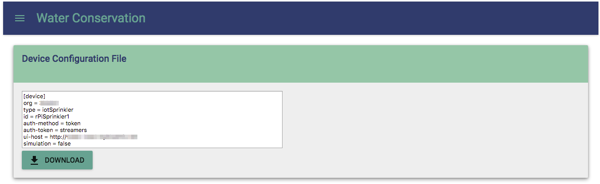

# Moisture Sensing Quarks Application

## Overview

This application reads moisture data from the moisture sensor and makes decision to turn on the sprinkler (i.e. the buzzer), when conditions are met.  It passes moisture data to the Watson Internet of Things Platform, and the Streaming Analytics application ingests the data and make makes the final decision on the sprinkler control.

## Setting up device configuration file

Once the Node.js application is deployed on Bluemix, it generates a device configuration file.  This application uses the device configuration file to connect to the Watson Internet Of Things Platform, as well as to the dashboard on the Node.js application.

To download the device file, click the hamburger icon on the top left corner, and select Settings, then Download the `device.cfg` file.  A [sample file](device.cfg) is stored in the root directory of the project for reference.

## Setup project on your workstation

1. Import the eclipse project in `com.ibm.streamsx.smartsprinkler.quarks`
1. Download [Apache Quarks][1] and [Pi4J][2] libraries, and make the jar files available on your machine.  This project assumes they are installed in `/opt/quarks` and `/opt/pi4j` respectively.  If you installed the libraries in a different location, adjust the project build paths accordingly.
1. Copy the device configuration file to the root of the project

## Running Simulation on your workstation

1. Ensure the Node.js application (i.e. the dashboard) is running on Bluemix.
1. Modify `device.cfg`, and set the property `simulation` to `true`.
1. Ensure the property `ui-host` is set to the URL of the Node.js application.
1. Right click `SmartSprinklerApp.java`, and Run as Java Application.
1. The dashboard should plot the moisture data received by this application on the graph.

## Running on your Raspberry Pi

1. Create a runnable Jar file by right clicking on the project, and Export as a Runnable JAR file.
1. Select the launch configuration that was created when you run the simulation on the workstation.
1. Select an appropriate destination file name for the runnable jar.
1. Select `Package required libraries into generated JAR`.
1. Click `Finish` to create the runnable JAR.
1. Copy the runnable JAR and the `device.cfg` to the Raspberry Pi.
1. Ensure the property `simulation` in `device.cfg` is set to `false`.
1. On the pi, `sudo java -jar <runnable.jar>`. (You must be root to run this)
1. The dashboard should plot the moisture data received by the pi on the graph.

# Links
* Apache Quarks: http://quarks.incubator.apache.org
* Pi4J: http://pi4j.com
* Pi4J Pin Numbering: http://pi4j.com/pins/model-b-rev2.html

[1]: http://quarks.incubator.apache.org
[2]: http://pi4j.com
